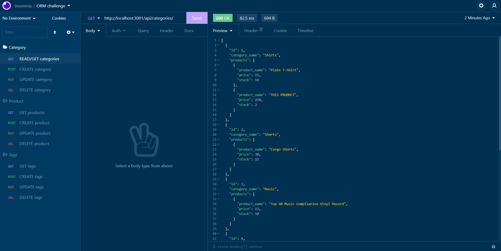

  # eCommerce-work
  

  ## Description
  This purpose of this project is to create a functioning back-end for e-commerce site use. Primary functions are to be able to create, read, update, and delete categories, products, and tags. This application utilizes node.js, express, and sequelize.

  ## Table of Contents
  * [Installation](#installation)
  * [Usage](#usage)
  * [Questions](#questions)

  ## Installation 
  To install this project, download node.js. Then clone the repo, and run `npm install` to install necessary packages.

  Link to Github Repo: [https://github.com/krissmith7/ecommerce-work](https://github.com/krissmith7/ecommerce-work)

  ## Usage
  Once application is installed, use `npm run seed` to seed the data and `node server` to invoke the application.

  Example of the application in use can be found in the following link.
  
  [Click here to see a video of the application.](https://watch.screencastify.com/v/QqtUyvInMpS2pQmsk3sW)

  ## Questions
  Contact the developer with any questions!

[https://github.com/KrisSmith7](https://github.com/krissmith7)

